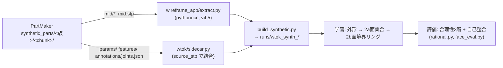

# PartMaker 刷新 引継ぎ書(2026-09-03)

宛先: PartMaker を刷新する開発者(Gemini セッション)
差出: AutoMetalSheet 側(ML パイプラインの実装・評価を担当する Claude セッション)
作成日: 2026-09-03

この文書は **PartMaker(合成板金部品ジェネレータ)を作り直す人が最初に読む一枚** として書いた。
プロジェクト全体の中で PartMaker が何を担い、下流(AutoMetalSheet の学習・評価)が何を要求し、
どの方式で作り直すべきかを、測定済みの事実に基づいて記す。推測は「未検証」と明示する。

---

## 0. 30秒サマリ

- **プロジェクトの目標**: 締結点(位置+軸)だけを入力に、板金部品の**中立面**を E2E 生成する
  (外形 → 曲げ/面 → メッシュ → 将来 B-rep)。形状ルールは一切書かず、すべて学習で獲得する。
  さらに**言語モデルとの統合**(言葉→形状、形状→言葉)を PoC で実証する決定がある。
- **PartMaker の位置づけ**: この学習の**唯一の教師データ供給源**。実車データ(Tesla Model 3 BIW)には
  2点締結部品が 0 件しかないため、合成データが無いと学習が成立しない。現在 2807 部品・2 部品族。
- **いま学習を止めているのはデータ側の制約**: 締結点は常に 2、折りは常に 2、穴なし、部品族は 2。
  「締結点 3 個以上」「穴あり」「折り 3 本以上」「ビード 2 個以上」は**表現は対応済みだが 1 件も検証できない**。
- **方式の結論: CATIA/DELMIA の COM 操作をやめ、OCCT(pythonocc-core / build123d)で STEP を直接生成する。**
  速度は 12〜27 秒/部品 → 1 秒未満(見込み)、ライセンス・GUI・クリップボード不要、並列化・Kaggle 実行が可能。
  品質は「解析曲面(平面・円柱・トーラス)だけで構築する」ことで CATIA と同等の教師(エッジ=単一の直線/円弧)を保てる。
  CATIA/DELMIA は**検証用の対照**として残す。
- **付加すべき情報**: 既存 4 点(STEP / params / features / joints.json)は壊さず、
  **面ラベル・展開図・構築プログラム・自然言語キャプション・族メタデータ**を足す。これが言語統合 PoC の材料になる。

---

## 1. プロジェクト全体像と PartMaker の位置づけ

### 1.1 リポジトリと役割

| 場所 | 役割 |
|---|---|
| `C:\Users\hide2\IdeaBox\AutoMetalSheet` | **ML 本体。**学習・評価・KB(知識ベース `docs/KB/`)。哲学と評価習慣は `CLAUDE.md` |
| `C:\Users\hide2\IdeaBox\PartMaker` | **合成部品ジェネレータ(本書の対象)。**`synthetic_parts/<族>/<chunk>/{mid,params,features,annotations}` を出力 |
| `C:\Users\hide2\IdeaBox\fill_volume` | 実車データの中立面+締結点アノテーション(§5)と **ワイヤーフレーム抽出器** `wireframe_app/extract.py`(schema `wireframe v4.5`)。ML 側はこれで STEP を読む |
| `C:\Users\hide2\IdeaBox\catia_analyze\Model3\02-BIW` | Tesla Model 3 BIW の CATIA 原データ(§5) |

### 1.2 データの流れ



### 1.3 ML 側の現在地(2026-09-03、測定済み)

| 段 | 状態 |
|---|---|
| 締結点フレーム | N≥2 に一般化済み(構造的に N=2〜5 通過。**重みは N=2 しか知らない**) |
| 外形 | **合格水準**(ビード族 val: 座面100%、スパイク0、余剰回転 1.1×、近傍 2.1mm)。CATIA のエッジ分割を教師に採用(KB 18) |
| 曲げ/面 | **面ループ表現**(面=生成単位、境界=閉リング)。ビード族 val: 未整合 9.2%、余剰 2.8×、未被覆 33% — 未合格 |
| 面構築・メッシュ・B-rep | 未着手 |
| 汎化 | **フランジ族(未見)で 3 段とも破綻**(外形は約半数がビード族の形に化ける)。全段に全族を見せる再学習を実行中 |

ロードマップ: `AutoMetalSheet/docs/KB/22_status_roadmap.md`(P0 汎化判定 → P1 面表現改訂 → P2 メッシュ → P3 族拡張 → P4 B-rep → P6 言語統合)。
言語統合の計画: `AutoMetalSheet/docs/KB/23_language_integration.md`。

### 1.4 ML 側の哲学(PartMaker にも効く 3 点)

1. **本数を先に決めない。**折り 2 本・ビード 1 つ・6 スロット…はすべて誤りだった。**個数は分布からサンプルし、上限は「容量」として別に報告する。**
2. **導出できる情報を条件に足しても効かない**(4 回失敗)。効くのは**締結点から導けない設計上の決定**だけ。
   → PartMaker が出す `params`(生成器の入力)は「導けない情報」の代表で、実際に効いた(R² 0.28→0.42)。
   **設計決定をメタデータとして残すこと**が、そのまま学習の条件と言語 PoC の材料になる。
3. **特定形状への特化を許容しない。**族ごとにホールドアウトを置いて評価するので、族メタデータは必須。

---

## 2. 現行 PartMaker の実態(調査結果、2026-09-03)

### 2.1 構成

- パッケージ `synthetic_generator/src/synthetic_generator/`: `gsd_build.py`(1689 行、**全 COM 呼び出し**)、`classify.py`(構成クラス 5 種+自由折りチェーン解法、純 Python)、`bead.py`、`flange.py`、`corner_relief.py`、`general_geometry.py`(CATIA 不要の幾何計画+実行可能性判定)、`templates/general_two_point.py`(本番サンプラ)、`batch_generate.py`、`annotation_schema.py`
- 実行: `tools/run_production_batch.py` / `run_long_production.py` / `run_one_chunk.py` / `run_flange_chunk.py` / `run_flange_series.py`(DELMIA を chunk 毎に再起動)
- ドキュメント: `docs/synthetic_two_joint_generation_roadmap.md`(設計本体)、`docs/catia_bead_fillet_investigation_log.md`(COM 調査 §0〜15、**§16〜18 は未執筆**)、`docs/lessons_bead_generation.md`(**最初に読む**)、`docs/bead_construction_flowchart.md`
- README なし。`synthetic_parts/` は gitignore(2807 部品はローカルのみ)

### 2.2 生成方式: GSD サーフェスを COM で直接構築(Sheet Metal・ソリッド不使用)

中立面を **GSD 面として直接作る**(矩形 Fill → Join → エッジフィレットで曲げ → ビードは Sweep+Split+BiTangent フィレット、
フランジは Sweep(3mm 貫通)+BiTangent、コーナーリリーフは Split)→ Copy/PasteSpecial → SaveAs → ExportData("stp")。
2026-08-25 に CATIA ライセンスを失い、**DELMIA** で同じオブジェクトモデルを動かしている。

### 2.3 実測の弱点

| 問題 | 実態 |
|---|---|
| **速度** | 11.6 s/部品(理想)→ セッション劣化で 15.6 → 27.5 s/部品(prod01、7h、RSS 0.8→1.8GB)。chunk 毎に DELMIA 再起動で緩和 |
| **BRep エッジ参照フィレットはスクリプト不可** | Generic Naming の曖昧性。GUI クリックでしか動かない → BiTangent 方式に迂回(log §3.1) |
| エッジフィレットの脆弱性 | 72+ 通りを試しても再現条件が見つからない、特定の 3D 配置で失敗 → ValueError で再試行 |
| クリップボード | PasteSpecial が空を貼る(30 部品中 4)。面数検査+3 回再試行 |
| ライセンス・GUI・単一プロセス | Kaggle/Linux 実行不可、並列不可、夜間実行は CATIA 起動が前提 |
| 既知の欠陥データ | `batch02` のフランジ 24 部品は前面側フランジ/両面フランジ/刃状切断の欠陥あり(log §14.8「要再生成」) |
| 未実装 | 戻りフランジ、フランジ外形コーナー R(`corner_radius_mm` はサンプルされるが未使用)、`reinforcement_direction_deg` 未使用、ボス |

### 2.4 現行の出力契約(壊してはいけない)

```
synthetic_parts/<族>/<chunk>/
  mid/<part_id>_mid.stp           1 OPEN_SHELL、mm、STEP AP214 相当
  params/<part_id>.json           spec(7 キー)+ bead|flange、UTF-8
  features/<part_id>.json         schema partmaker_features/1(panels/folds/bead/flange/corner_relief)
  annotations/joints.json         schema 1.1、部品ごとに 2 joint(type mounting_hole、axis、hole_center_xyz、hole_diameter_mm)
```

- ML 側の結合キーは **`source_stp` のパス**(part_id は chunk 間で重複する。過去にこれで 90.6% のバグを出した)
- ML の条件 `SPEC_KEYS` = `thickness_mm, half_width_mm, bend_radius_mm, fold1_slack_mm, fold2_slack_mm, min_bearing_radius_mm, hole_diameter_mm`
  (`AutoMetalSheet/.../wtok/sidecar.py`)。**新族でもこの 7 キーを埋める**(埋まらない族は入力行が欠けて劣化する)
- 新族の登録は ML 側 2 箇所(`build_synthetic.GROUPS`、`tools/build_mesh_dataset.source_dir`)。§4.6 のマニフェスト化で自動発見にしたい
- **既存フィールドの削除・意味変更は禁止、追加のみ**(2026-08-30 要求書 §5、これまで遵守)

---

## 3. 方式の判断: CATIA 直接操作 vs STEP 直接生成

### 3.1 判定基準

下流が要求する**教師の品質**は次の 3 点に集約される(KB 18, 21)。

1. **エッジが解析プリミティブ 1 本**(直線 or 円弧、スプラインなし)。CATIA 出力は 1084 エッジ中 0.0% が 0.25t を超過 — これが G1 教師の基盤
2. **面の位相が閉じている**(各面の境界エッジが 0.05mm 溶接で閉ループ、`face_ids` 付き)— 面ループ表現の前提。CATIA 出力は 2300/2300 で 100%
3. **合理性の床が満たされている**: 座面比 1.0、スリバー 0、R/t ≥ 2(99.5%)、ゴミエッジ(0.008mm)なし

速度の要求: 族拡張(P3)は「族ごとに数百〜千部品」を繰り返す。言語 PoC はさらに多様な部品を要る。

### 3.2 比較

| 観点 | CATIA/DELMIA COM(現行) | OCCT で STEP 直接生成(pythonocc-core / build123d) |
|---|---|---|
| エッジ品質 | ○ 単一プリミティブ | ○ **解析曲面だけで構築すれば同等**(平面/円柱/トーラスの交線は直線/円弧)。スイープ経路を直線+円弧に限定すれば B-spline は出ない。経路や断面に自由曲線を使うと B-spline 面が出て劣化(抽出器は 0.25mm 以内なら吸収するが G1 教師は鈍る)|
| 面の位相 | ○ | ○ 構築時に面の同一性が既知 → **face_ids を推定でなく生成時に付与できる**(推定より確実) |
| 中立面 | GSD 面を直接構築(抽出なし) | 同じく面を直接構築(抽出なし)。**構造は現行と同型** — `general_geometry.py`/`classify.py` の幾何計画はそのまま流用できる |
| フィレット | エッジ参照不可、BiTangent 迂回、脆弱 | 3D フィレット演算(`BRepFilletAPI_MakeFillet`)はシェルに対して CATIA より弱い。**回避策: 断面を解析的に定義してスイープ**(ビード断面 = 壁+稜線 R+足 R を 2D で閉じた G1 プロファイルとして作り、中心線に沿ってパイプシェル)→ フィレット演算そのものを使わない |
| 速度 | 12〜27 s/部品、セッション劣化 | **0.1〜1 s/部品(見込み、未計測)**、劣化なし、`multiprocessing` で並列 |
| 実行環境 | Windows + DELMIA ライセンス + GUI | Python のみ。Linux/Kaggle 可。抽出器と同じ pythonocc-core(conda-forge)で**ツールチェーンが統一**される |
| 堅牢性 | クリップボード・Generic Naming・Update 連鎖 | 例外が Python で捕捉できる。失敗はブール/スイープの失敗で、現行の「構築可能性を純 Python で先に判定 → 失敗は再サンプル」方針がそのまま使える |
| リスク | ライセンス消失(既に 1 回)| OCCT のブール演算(ビードを基面に載せる Split)が特定配置で失敗する可能性。**未検証** |
| 実車らしさの担保 | CATIA=実車 CAD と同じカーネル | 幾何は同じ数式。ただし「CATIA がどう分割するか」の再現ではなく「解析曲面の交線」になる。教師の定義は「合理的なエッジ分割」なので、**ML 側の評価が同じ床を出せば同等とみなす**(§3.4 のゲート) |

### 3.3 結論

**OCCT による STEP 直接生成に移行する。**理由は (a) 速度と実行環境が族拡張・言語 PoC の律速を外す、
(b) 面の同一性を生成時に持てるので教師が推定から事実になる、(c) 現行の設計の核(自由折りチェーン、実行可能性判定、
サンプラ、サイドカー)は CATIA 非依存で流用できる — 置き換えるのは `gsd_build.py` 1 ファイル相当。

CATIA/DELMIA は**捨てない**: (1) 移行ゲート(§3.4)の対照、(2) OCCT で作れない特徴が出たときの退避、(3) 実車データ処理(§5)。

### 3.4 移行ゲート(合格条件を先に書く — ML 側の習慣 F)

同じ `spec` を両方式で生成し、`wireframe_app/extract.py`(v4.5)で抽出して比較する。

| 条件 | 合格 |
|---|---|
| A. エッジのプリミティブ適合 | 0.25t 超過 0.0%(CATIA と同値) |
| B. 面ループ閉合 | 非壁面 100% 閉合(CATIA と同値)、`face_ids` 付与率 100% |
| C. 合理性の床 | 座面比 1.0、スリバー 0、R/t≥2 100%、0.05mm 未満のゴミエッジ 0 |
| D. 幾何一致 | 両方式の中立面の再サンプル(1mm 間隔)Chamfer ≤ 0.3mm(抽出ノイズ ±0.2mm の範囲)|
| E. ML 回帰 | 既存 2300 部品を OCCT で再生成して外形モデル(`runs/frame_g1sm2` 相当)を再学習し、旧 val で近傍・余剰・座面が ±ノイズ内 |
| F. 速度 | ≤ 2 s/部品(単プロセス)|

D と E が通れば「教師として等価」。A〜C はサンプル 100 部品で先に測る(1 日)。

### 3.5 実装の指針(OCCT)

- **面を先に、解析曲面だけで**: パネル=平面(`BRepBuilderAPI_MakeFace` にワイヤ)、曲げ=円柱面のトリム(`Geom_CylindricalSurface`+`BRepBuilderAPI_MakeFace(surface, umin,umax,vmin,vmax)`)、パネルと曲げは**エッジを共有して縫合**(`BRepBuilderAPI_Sewing` 0.01mm)。これで面ループが構築的に閉じる
- **ビード/フランジ/リブは断面スイープ**: 断面(壁角・深さ・稜線 R・足 R)を 2D の直線+円弧で G1 に閉じ、平面図の経路(直線+円弧の角丸矩形)に沿って `BRepOffsetAPI_MakePipeShell`。角丸経路の円弧区間は自動的にトーラス面になる(CATIA の 125 面と同じ構造)。基面が曲がっている(曲げをまたぐ)場合は、**展開平面で構築 → 折り曲げ写像**は非可展開特徴に対して厳密でないので、CATIA と同じ「基面上に投影した経路+基面法線方向の断面」を取る。ここが唯一の未検証点
- **穴は最後に**: `BRepAlgoAPI_Cut` ではなく面のワイヤに内側ループを追加(平面上の円 → `BRepBuilderAPI_MakeFace.Add(inner_wire)`)。曲げにかかる穴は円柱面上の 3D 曲線として付与
- **面ラベル**: XCAF(`STEPCAFControl_Writer`)で面に名前を付けて STEP に書く(`panel_0`, `bend_0`, `bead_0_wall`, `bead_0_top_ridge`, `flange_0_root`, `hole_2`…)。抽出器側は `STEPCAFControl_Reader` で読める。名前が読めない場合の保険として `features/` に面重心の一覧も出す
- **実行可能性判定は純 Python で先に**(現行の `general_geometry.py` の方針を維持): OCCT の失敗は高価なので、パネル干渉・座面・R/t・特徴同士の干渉は数式で弾く
- **STEP は AP214 で 1 OPEN_SHELL**、mm、UTF-8 JSON — 現行契約を維持

---

## 4. 何を生成し、何を付与すべきか

### 4.1 優先順位付きの部品族(ML 側の要求、KB 19/22/要求書より)

| 優先 | 族 | 理由 | 備考 |
|---|---|---|---|
| **1** | **締結点 3〜6 個の部品**(折り 2〜5 本、パネル 3〜6 枚) | 最深の特化(重みは N=2 しか知らない)。実車 140 部品に 2 点締結は 0 件 = 現データは分布外 | 締結点ごとに `min_bearing_radius` と `hole_diameter` を別に持つ(ML 側コードは既に締結点ごとにループする) |
| **2** | **穴あり**(締結穴を実際に切る+アクセス穴/軽量化穴) | 多ループ表現は実装済み・休眠中(コスト 0)。1 件も検証できない | `hole_boundary` は抽出器・変換器とも対応済み |
| **3** | **複数特徴**: ビード 2 本、ビード+フランジ、折りをまたぐリブ、ディンプル/エンボス(背骨なし)、ルーバー(切り込み)、ヘム、タブ、ノッチ | 「分類を先に決めない」の実証材料。ビード/フランジ/リブの区別が連続体になることを ML は既に観測(主成分 2 つで 98%) | `run_out` が全部品 1.00 固定で検証不能 → 変える |
| **4** | **折り 3 本以上・逆曲げ(S 字)・角度 90° 超・小 R(R/t 2〜3)** | 製造限界の境界を学習で獲得させる | R/t≥2 は数少ない絶対合格条件 |
| **5** | **2〜3 部品のアセンブリ**(締結点を共有) | 言語 PoC(「A と B をつなぐブラケット」)と、fill_volume が目標にする BERT 風マスク部品予測 | `joints.json` の `parts` に 2 部品を入れる(実車の weld/bolt と同型) |
| 6 | 実車統計に合わせた分布(板厚 0.6〜2.5mm、締結間隔、穴径)| §5 の joints.json 923 件から分布を取る | 現行は t∈U(1.0,2.5)、区間距離 U(120,220) の一様 |

**個数の指定はしない**: 折り本数・穴数・特徴数は分布からサンプルし、**族ごとの最大値(面数、外形エッジ数、リング点数)を
マニフェストで報告**する。ML 側はそれで容量を決める(現在 FACE_SLOTS 144 に対しビード族 125 面/部品、フランジ族 31 面/部品)。

### 4.2 付与すべき情報(既存 4 点は維持、以下を追加)

| 情報 | 用途 | 形式案 |
|---|---|---|
| **面ラベル** | 面ループ表現(2a/2b)の教師。役割・幾何種・半径・所属特徴 | STEP 面名(XCAF)+ `features.faces[] = {name, role, geo(planar/cyl/torus/sphere), radius_mm, feature_ref}` |
| **締結点ごとの座面情報** | 座面拘束(sample(constrain=))を締結点ごとに | `joints.json` per_part に `bearing_radius_mm`, `seat_normal_xyz`, `hole_cut: bool` |
| **折りテーブル(N 本)** | 展開図表現(KB 16.5)、製造可能性 | `features.folds[]` を N 本に一般化(既存形式のまま) |
| **展開図** | 板金 CAD の定義そのもの。将来の表現候補 | `features.flat_pattern = {outline_2d, bend_lines_2d, bend_table}`(生成器は 2D 自由折りチェーンで構築しているので厳密に出せる) |
| **構築プログラム** | 言語統合 案C(LM が計画、幾何は決定的に実現)の教師。CAD-Recode 型の学習材料 | `program.json`: 順序付き操作列 `[{op:"panel", ...}, {op:"fold", angle, radius, axis}, {op:"bead", ...}, {op:"hole", ...}]`。**spec から決定的に再構築できること**(現行 params と同じ性質)|
| **自然言語キャプション** | 言語統合 P6(言葉→形状、形状→言葉) | `captions.json`: (a) 構造化事実(族、締結点数、折り本数と角度、特徴、板厚)、(b) 事実から機械生成した文(日英、複数の言い換え)、(c) **生成器の規則に由来する理由**だけを「理由」として書く(例: 「最大折り角 ≤20° のためフランジを選択」は生成器の実規則なので真。それ以外の理由は書かない — 幻覚防止)|
| **族・構成メタデータ** | ホールドアウト設計、特化の監査 | `manifest.json`(§4.6)に family, config_class(5 種), generator_version, seed, difficulty |
| **質量特性** | 検証用(条件には使わない — 導出可能情報は効かない) | 面積、展開長、bbox、慣性主軸 |
| **レンダリング** | VLM/言語 PoC と QA | 4 方向 PNG(現行 `render_montage.py` 相当を OCCT 描画で) |
| **完了マーカー** | ML 側が未完成 chunk を取り込まないため | chunk 直下に `_COMPLETE` と部品数 |

### 4.3 出してはいけないもの / 注意

- **締結点から導出できる情報を「条件」として推奨しない**(曲率場、点群など。ML 側で 4 回失敗)。付与するのは自由だが、用途は検証・教師に限る
- **ゴミ幾何を出さない**: 0.05mm 未満のエッジ(現行 607 本)、平面|平面の継ぎ目(`seam`、曲面エッジから 0.3mm の位置に 602 本 — Split/Join の痕跡と推定、**未確認**)は構築時に消せる
- **板厚未満の短辺**は実在(8.9%、座面とは無関係)。ML 側はスリバーとして扱うので、意図的でない限り出さない
- `face_wall` は抽出器の半径ヒューリスティック(20mm)の名前で「厚み壁」ではない(中立面に壁はない)。生成器側では無視してよい

### 4.4 実車データの使い方(§5 を参照)

1. **パラメータ分布の較正**: 板厚・締結間隔・穴径・曲げ R の分布を実車 joints.json/STEP から取り、合成分布に反映
2. **実車テストセット**: ロードマップ §1 が義務付ける「合成は train のみ、val は実車」のゲートに使う(現状は合成 val で代用)
3. **族の語彙**: BIW のブラケット形状を族設計の参照にする(特定形状の複製ではなく、特徴の組合せの語彙として)

### 4.5 ML 側の測定値で PartMaker の品質に効くもの

| 事実 | 出典 | PartMaker への含意 |
|---|---|---|
| 同じ締結条件の部品同士が 14.9mm 違う(情報限界) | KB 01 §1.5 | 「締結点→形状」は一意でない。**設計決定(spec/キャプション)を必ず残す**。これが唯一効く条件 |
| spec 7 キーで R² 0.28→0.42 | KB 12, sidecar.py | 新族でも spec を出す。締結点ごと・特徴ごとに拡張 |
| CATIA エッジは単一プリミティブ(0.0% 超過) | KB 18 | OCCT でも解析曲面のみで構築する(§3.5) |
| 面ループは 100% 閉じる、125 面/部品(ビード)、31 面/部品(フランジ) | KB 21.9, 21.17 | 面数は族で 4 倍違う。容量報告を族ごとに |
| 面ループの教師床: 未整合 0.0% | KB 21.10 | 生成時の縫合(sewing)でこの床を構築的に保証できる |
| フランジ族(未見)で外形が約半数ビード族に化ける | KB 21.17 | 族は**混ぜて**供給する(族ごとの chunk でも可だが、学習は全族同時)。族ラベルは評価用 |
| 学習は部品数で伸びる(2a: 1000→2200 部品で 2.472→2.415mm)、エポックでは飽和 | KB 21.16 | **数が効く** → 速度が価値。OCCT 化の主目的 |
| 抽出ノイズ ±0.2mm | KB 05 | 幾何一致の閾値はこれ以下に置けない |
| `batch02` フランジ 24 部品は欠陥 | log §14.8 | 再生成対象。OCCT 化後の最初の回帰対象に |
| 2 点締結は実車に 0 件 | roadmap §1 | 合成 N=2 は分布外。**N≥3 が最優先** |

### 4.6 マニフェスト案(ML 側の自動発見用)

```json
{
  "schema": "partmaker_manifest/1",
  "family": "multi3",              // 族 id(ディレクトリ名と一致)
  "chunk": "chunk_01",
  "generator_version": "2.0.0",
  "backend": "occt",               // occt | catia | delmia
  "seed": 1000,
  "complete": true,
  "n_parts": 250,
  "fastener_count": {"min": 3, "max": 6},
  "capacity": {"faces_max": 140, "outline_edges_max": 28, "ring_points_max": 16, "loops_max": 4},
  "config_classes": {"orthogonal": 70, "oblique": 60, "...": 0},
  "spec_keys": ["thickness_mm", "..."],
  "files": {"mid": "mid/{id}_mid.stp", "params": "params/{id}.json", "features": "features/{id}.json",
            "program": "program/{id}.json", "captions": "captions/{id}.json", "joints": "annotations/joints.json"}
}
```

part_id は **族+chunk を含めて全体で一意**にする(例 `multi3_c01_0001`)。`source_stp` 結合は維持。

---

## 5. 実車データの所在(引継ぎ)

### 5.1 `C:\Users\hide2\IdeaBox\fill_volume\fill_mid_surf`

穴を埋めた中立面 STEP と締結点アノテーション。詳細は **`fill_volume/HANDOFF.md`**(必読)。

| アセンブリ | 部品 | 締結 | 内容 |
|---|---|---|---|
| `A0072600002_AllCATPart` | 43 | 459(weld 250 / bolt 70 / other_hole 125 / mounting_hole 14)| `mid/`(穴あり)+ `fill/`(穴埋め=正準)+ `CATParts/` + `Edit/` + `annotations/joints.json` |
| `A0072601285_AllCATPart` | 32 | 464(weld 346 / bolt 19 / other_hole 99)| `fill/` + `Edit/` + `mid_to_body_mapping.json` |
| `A0072600529_AllCATPart` | 65 | 12(アノテーション途中)| `mid/` + `fill/`(各 65)+ `CATParts/` + `Edit/` + `annotations/` + `wireframes/`。HANDOFF.md 執筆後に追加された 3 番目のアセンブリ |
| `A0072600155_AllCATPart` | — | — | `CATParts/` + `Edit/` のみ(中立面未抽出)|
| `A0072600081/367/643_AllCATPart` | — | — | `CATParts/` のみ(分割済み、未編集)|

合計: STEP 248、CATPart 614、JSON 145。座標はアセンブリ座標(mm)。`joints.json` は schema 1.1(PartMaker が採用している形式の原典)。
締結軸 = 板厚方向。穴検知は `annotation_app/holes.py`(mid と fill の差分で真の締結穴を確定)。

### 5.2 `C:\Users\hide2\IdeaBox\catia_analyze\Model3\02-BIW`

fill_mid_surf の元データ: **Tesla Model 3 の BIW(Body in White)板金 CATIA データ**。CATPart 27、CATProduct 12、3dxml 1、合計 1.2GB。
`A0072600234/A0072600001/A0072600002_AllCATPart.CATPart` など、多ソリッド同梱の AllCATPart 形式。
中立面化の COM 手順と制限(クロスドキュメント貼付不可、ThickSurface 4 引数、Update 連鎖など)は
AutoMetalSheet 側のメモリ `catia_com_knowhow` / `catia_midsurface_export` に蓄積(要旨は `fill_volume/HANDOFF.md` §2)。

### 5.3 使い方

§4.4 参照。実車は**評価とパラメータ較正**に使い、学習には(当面)使わない(1〜2 アセンブリでは暗記になる — fill_volume HANDOFF §6)。

---

## 6. PartMaker 刷新に伴う ML 側の在り方の変更(検討事項、決定ではない)

ユーザーは「PartMaker の刷新に合わせて ML 側(特に言語統合時点)の在り方を変えるのもあり」としている。選択肢を挙げる。判断はユーザー。

| 案 | 内容 | 利点 | 懸念 |
|---|---|---|---|
| **α 現行維持+教師強化** | フロー生成器はそのまま。面ラベル・展開図・キャプションを教師/条件に追加 | 既存の評価系と知見が全部使える。P0〜P2 と両立 | 面の整合(B1)は表現の問題として残る |
| **β 構築プログラムを中間表現に** | 言葉 → LM → **構築プログラム** → OCCT が幾何を決定的に実現(案C の具体化)。フロー生成器はプログラムで表せない自由形状に限定、または族が文法に収まるなら不要 | 製造可能性・閉合・座面が**構築的に保証**される。形状→言葉もプログラム→文で接地しやすい | **文法=形状ルール**であり、プロジェクトの原則「形状ルールを書かない」と緊張する。汎用性は文法の表現力で上限が決まる。文法は PartMaker(データ側)が持ち、ML 側はそれを出力する学習(CAD-Recode 型)になる |
| **γ ハイブリッド** | 締結点→外形はフロー(設計決定の曖昧さを K 候補で扱う)、外形→面はプログラム的に構築(外形+折りテーブルから OCCT で面を張る) | B1(面の整合)を構築で解く。KB 21.11 で一度棄却したハイブリッドを、整合済み外形+折りテーブル前提で再検討 | 折りテーブルの生成が新たな学習課題になる |

推奨: **まず α で PartMaker を刷新し(データ契約は維持)、構築プログラムとキャプションは「追加の教師」として出す。**
β/γ に進むかは P0(汎化)と P1(面表現)の結果を見て決める — プログラムが出ていれば、その時点で即実験できる。

---

## 7. 刷新の段取り(提案)

| 段 | 内容 | 出口 |
|---|---|---|
| S0 | 現行コードの CATIA 非依存部分(`classify.py`, `general_geometry.py`, `bead.py`, `flange.py`, `templates/`, `batch_generate.py`, `annotation_schema.py`)を確認し、`gsd_build.py` の**インターフェース**(spec → 面の集合)を書き出す | 置換範囲の確定 |
| S1 | OCCT バックエンドの最小版: パネル+円柱曲げ+縫合+STEP 出力(XCAF 面名付き)。既存 2 点締結 spec 100 件で §3.4 A〜D を測る | ゲート A〜D |
| S2 | ビード/フランジ/コーナーリリーフを断面スイープで実装。`batch02` フランジを再生成 | 既存族の再生成が可能 |
| S3 | 既存 2300+507 を OCCT で再生成し、ML 側で外形モデルを再学習(ゲート E)。同時に速度(F) | **教師等価の宣言** |
| S4 | 新族: N≥3 締結点(折り N-1 以上)、穴、複数特徴。マニフェスト・面ラベル・展開図・プログラム・キャプションを出す | ML 側 P3 開始 |
| S5 | アセンブリ(2〜3 部品)、実車分布較正 | 言語 PoC 材料 |

各段で ML 側に「マニフェスト+サンプル 5 部品」を渡せば、取り込み(`build_synthetic`)のスモークは 10 分で返せる。

---

## 8. 連絡・参照

- ML 側の要求書と返信: `AutoMetalSheet/docs/requests/`(2026-08-30 抽出要求 → REPLY → REPLY2、2026-09-01 face_ids → REPLY)。
  **未回答の問い**: `seam` クラスの意味(平面|平面の継ぎ目。生成手順の Split/Join 由来か?)、ビード稜線リフトの符号の記録
- ML 側の知識ベース: `AutoMetalSheet/docs/KB/00_INDEX.md` から。特に 01(課題とデータ)、12(条件付けの原則)、13(力学×幾何)、
  16(工学的成立性)、18(CATIA エッジ)、21(面ループ)、22(総括)、23(言語統合)
- 抽出器: `fill_volume/wireframe_app/extract.py`(v4.5、pythonocc)。バックアップ `extract.py.bak_v44`。fill_volume は git 管理外
- 実車: `fill_volume/HANDOFF.md`
- PartMaker 内の必読: `docs/lessons_bead_generation.md` → `docs/synthetic_two_joint_generation_roadmap.md` §3〜§5
